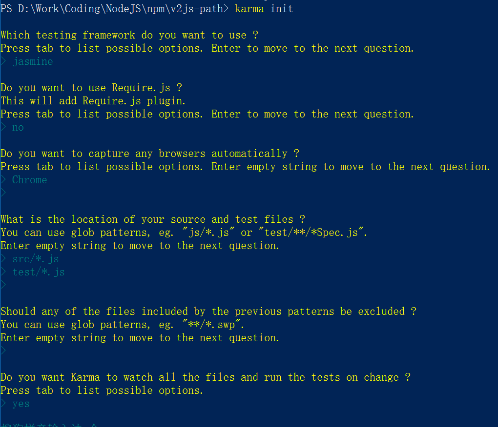
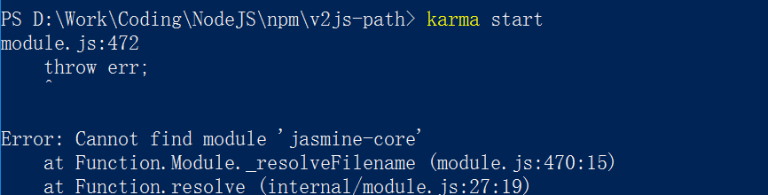

# 入坑 karma

- 标签： `Unit Test`
- 时间： `2017-3-16`

## 前言

最近打算把去年写的各种 `Gulp` 包打包成模块发布到 `npm` 上，为了代码的质量，我选用了 `karma` 这个测试框架来进行代码测试，不同于一般的测试框架(如 `mocha` )，`karma`是建立在一般的本地测试框架之上的，其强大之处体现在：

- 能启动一个web服务器，生成包含`源码`和`测试脚本`的页面；
- 能够在浏览器上显示测试的结果；
- 能够通过开启检测（`watch`）功能，当检测到文件变化时，自动热加载。


好了，跳坑之旅开始。

## 目录结构及待测试的代码

我的目录结构如下：

```markdown
// v2js-path
    ├── src
         ├── core.js
    ├── test
         ├── test.js
    ├── index.js
    ├── package.json
```

在我的 `core.js` 中有这样一个用来检测是否为文件路径的函数：

```js
function isFilePath(_path) {

    var reg = /^.*(\/|\\)[^\\/:*?""<>|]+\.\w+$/;
    return reg.test(_path);

}
```

## 安装karma

先全局安装`karma-cli`：

```
npm i -g karma-cli
```

接着给项目安装依赖：

```
npm i karma -D
```

接下来输入`karma init`, 来进行初始化：



注意，这里我选用的是`jasmine`作为测试框架。详细使用请参照[jasmine官网](https://jasmine.github.io/)

这里给出官网的范例：

```js
describe("A suite is just a function", function() {
  var a;

  it("and so is a spec", function() {
    a = true;

    expect(a).toBe(true);
  });
});
    
```

## 开始测试

在项目根目录下键入`karma start`开启测试，首先遇到了这样一个问题：



然后就安装呗，恩，如下：

```
npm i -D jasmine-core
```

可是，你会戏剧性地发现，即使 `chrome` 已经正常打开，你还是看不到测试结果。debug 按钮按下的控制台中。


