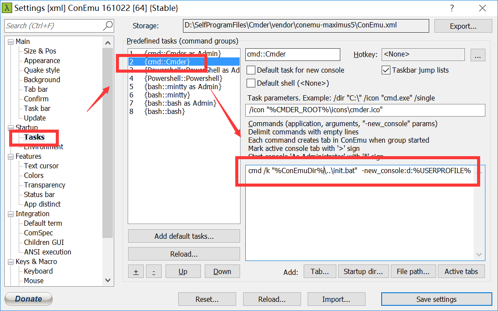

# cmder

## 解决cmder中文乱码：

打开设置; Startup-Environment; 添加 set LANG=zh_CN.UTF-8

## cmder Alias

```markdown
gitconfig=vi C:\Users\Administrator\.gitconfig
cmdalias=vim D:\Electron Program Files\Cmder\config\user-aliases.cmd
```

## cmder默认启动目录

`win + alt + p`打开设置，进入`Startup > Tasks`:



修改内容如下：
```cmd
cmd /k "%ConEmuDir%\..\init.bat"  -new_console:d:%USERPROFILE%
```

```cmd
cmd /k "%ConEmuDir%\..\init.bat"  -new_console:d:D:\
```
