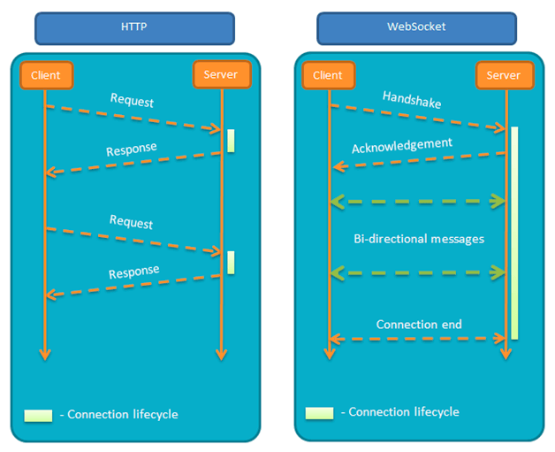

# WebSocket

##  为什么需要`WebSocket`？

HTTP协议的缺陷————通信只能由客户端发起。

## 单向请求的缺陷是什么？

如果服务端有连续的状态变化，客户端要获知就非常麻烦。虽然`轮询`可以解决问题，但是效率非常低下，因为必须不停链接，或者始终打开HTTP连接。

## Websocket的特点是什么？

- 服务器可以主动向客户端推送消息，客户端也可以主动向服务器发送消息；
- 同样建立在TCP协议之上，服务端实现比较容易；
- 与HTTP兼容，默认端口是80和443，且握手阶段采用HTTP协议；
- 数据格式轻量，性能开销小，通信高效；
- 支持文本和二进制；
- 无同源限制；
- 协议标识符：`ws`，若加密则为`wss`；

## 示例及API

[阮一峰：WebSocket 教程](http://www.ruanyifeng.com/blog/2017/05/websocket.html?utm_source=tuicool&utm_medium=referral)

