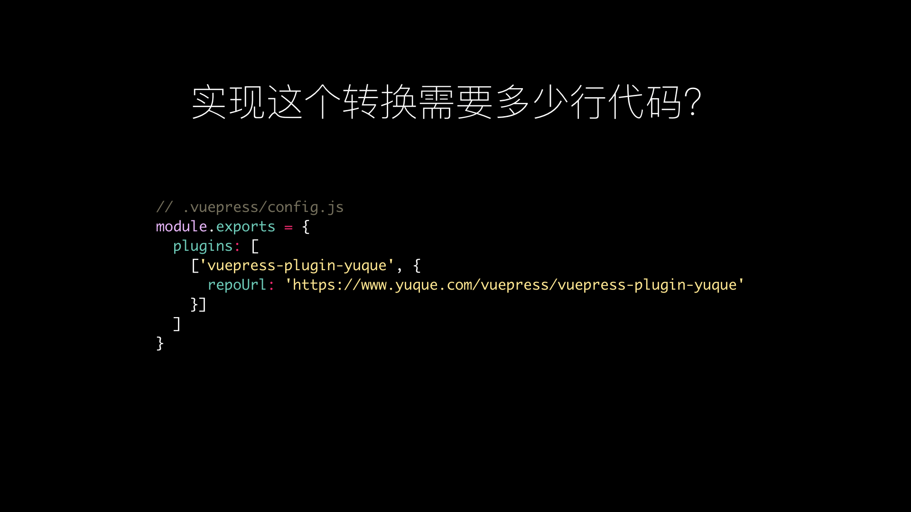
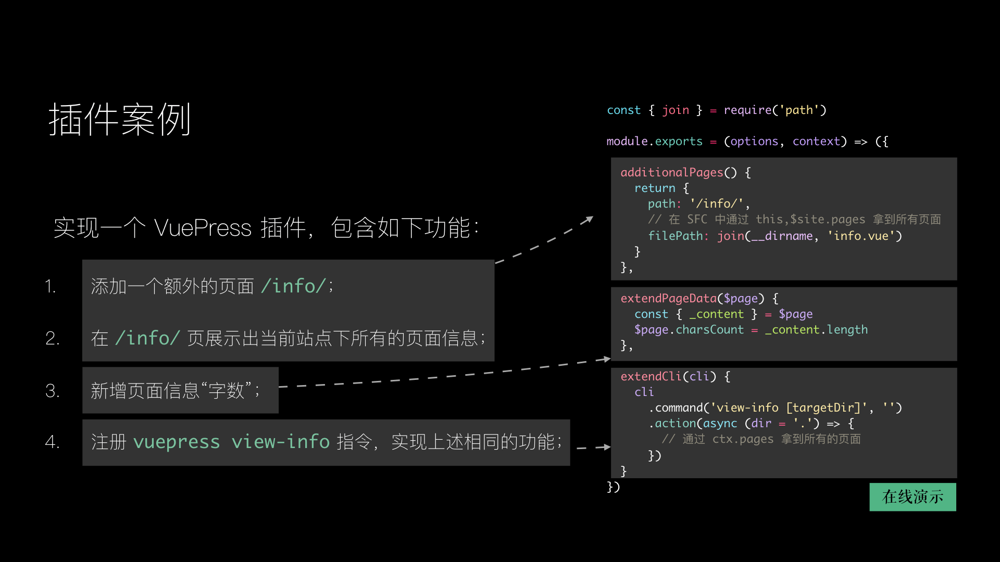

# Intro to VuePress 1.x

> 本文为 2019 年 6 月 8 日我在
> [3th VueConf Shanghai](https://vue.w3ctech.com/) 上发表的同名演讲实录。

<!-- Slides 可以在 <a href="/intro-to-vuepres-1.x.key"
> target="_blank">这里</a> 获取到。 -->

---

## 引言

大家下午好，我是来自蚂蚁金服微贷前端团队的真山，今天我给大家带来的主题是 Intro to
VuePress Next，也就是即将发布的 1.0 版本。

首先，我们来看一些来自社区的 VuePress 作品，这里要特别要特别感谢
[@vicberquist](https://github.com/vicbergquist) 在收集优质的 VuePress
站点上做出的贡献。

第一个，是来自 Alex Jover 的
[博客](https://vuepress.gallery/gallery/alex-jover.html):

第二个，是我个人比较喜欢的杂志风：

接下来这个， [vuesax](https://lusaxweb.github.io/vuesax/) ，一个优质的 vue 的组件库：

最后一个，是一个暗色系的站点：

如果你想要找到更多的案例，可以在拿到 Slide 后在下面的链接中继续查看。

- [vuepress.gallery](https://vuepress.gallery/)
- [awesome-vuepress](https://github.com/ulivz/awesome-vuepress)

## 什么是 VuePress?

看了这些例子，我相信，大家即使不熟悉
VuePress，也大概能够猜到它是一个搭建站点的工具。 恩，那我们首先来聊一聊，什么是
VuePress？

可能有很多同学都没有用过 VuePress，所以我们先来看一看 VuePress
最早的模样，也就是 VuePres 0.x。

首先，VuePress 是一个静态网站生成器。之所以叫
VuePress，最重要的一点在于它天然就支持
[在 Markdown 中使用
Vue](https://v1.vuepress.vuejs.org/guide/using-vue.html)
。在核心代码中，我们还有一个简单的主题系统，同时，又借助了这个主题系统内置了一个用于写文档的
[默认主题](https://v1.vuepress.vuejs.org/theme/default-theme-config.html)
，除此之外，还支持了一个
[布局系统](https://v1.vuepress.vuejs.org/theme/default-theme-config.html#custom-layout-for-specific-pages)
，方便让用户动态指定布局组件。

在这样的背景下，得益于其轻量且容易上手，我们很快地吸引了大量的用户。但随着时间的推移，迭代的增长，核心代码越来越多，似乎慢慢开始变得难以维护，与此同时，在用户提出的众多
feature request
中，有一些确实有价值的功能似乎也不太适合放在核心代码中。所以，我们在想，有没有一种办法，可以在避免主仓库代码无止境增长的前提下，又能够实现不限制新特性的增加呢？

于是，我们就开始了
1.x， VuePress 也在过去几个月，慢慢演变了成了接下来的这个样子。

首先，关于“主题”，我们从 “简单的主题系统” 演变成了 “主题系统”，也就是说，一个
VuePress 主题，将不再仅仅是一个
SFC，它可能还包含自己的样式、配置，以及我们接下来会聊到的插件。同时，我们新增了一个
[官方博客主题](https://github.com/ulivz/vuepress-theme-blog)
。此外，布局系统从默认主题中被抽离出来，这个非常 facny
的特性，也实现了跨主题间复用。

除此之外，可能是 1.x 最大的更改，就是我们新增了
[插件系统](https://v1.vuepress.vuejs.org/plugin/) ，1.x
的内部在某些核心功能上用插件 API
进行了实现，同时沉淀了出了大量可复用的插件。在这样的架构下，除了解决 0.x
存在的问题，我们还做到了，将 “基础核心” 和 “业务需求” 解耦，很多功能（如
[pwa](https://v1.vuepress.vuejs.org/plugin/official/plugin-pwa.html) 、
[search](http://localhost:8080/2019/06/09/intro-to-vuepress-1-x/)
）实现了在跨主题之间完美复用。

想了解更多 1.x 的设计理念，可以移步这个
[链接](https://v1.vuepress.vuejs.org/zh/miscellaneous/design-concepts.html)。

## 快速上手

既然知道了 VuePress 是什么，那么我们是否应该来上手一下：

为了让 VuePess 上手更简单，我们最近发布了 [create-vuepress](https://github.com/ulivz/create-vuepress) ，虽然它确实是一个 npm 包，但是并不意味着你需要首先手动地全局安装它。

我们可以借助包管理工具提供的原生能力来实现，这里我们以 yarn 为例来演示：

然后你就能得到一个跟
[VuePress 官网](https://v1.vuepress.vuejs.org/zh/) 长得差不到的文档站点了：

接下来，我们来看看，这个网站的项目结构到底长什么样子。

首先，你能看按到你的 docs 目录，里面有很多 markdown
文件，这些文件会根据它目录转换成对应的 url。最后这个约定的 `.vuepress`，它存放着
VuePress 所有的配置、约定的文件等。好，那我们来看下， 这的文件里面究竟有什么？

首先，是一个 components 目录，这个目录下的所有 Vue 组件都可以直接在 markdown
中直接使用。接下来的 `styles`，你可以在
[index.styl](https://v1.vuepress.vuejs.org/config/#index-styl)
中书写自定义样式，以及在
[palette.styl](https://v1.vuepress.vuejs.org/config/#palette-styl)
中进行全局调色。最后这个 config.js，也就是 vuepress 约定的
[配置文件](https://v1.vuepress.vuejs.org/zh/config) 。

这里有的同学可能会说，我不想在本地创建项目。

没关系，你还有一个选择 ——
[codesandbox](https://codesandbox.io/s/)，同样是来自
[@vicberquist](https://github.com/vicbergquist) 的精彩贡献！

当你新建完项目后，你可能会想，我不太喜欢这个默认的主题。

恩，那我们接下来聊聊 [主题](https://v1.vuepress.vuejs.org/zh/theme/) 。

## 主题

依照惯例，我们先来看一看现有的主题。

左侧，是默认主题，刚刚我们已经看过了，这里我们不再赘述。 右边这个，便是最近推出的
[博客主题](https://github.com/ulivz/vuepress-theme-blogging)
，你可以在刚刚新建项目使用的 `yarn create vuepress` 中，选择 `blog`
的样板来初始化这样一个博客。此外，最近这个主题迭代得非常频繁，如果你有兴趣，欢迎随时提交
MR~

有的用户可能会说：哎，我不喜欢官方推出的主题，怎么办？

恩，那就换个主题吧，社区里还有很多优质的主题可以直接使用。接下来，我会列举几个比较有特色的主题，让大家看一下。 

第一个，另一个文档主题：

- [vuepress-theme-bulma](https://github.com/nakorndev/vuepress-theme-bulma),
  by
  [@nakorndev](https://github.com/nakorndev)

第二个，有点简洁；

- [vuepress-theme-api](https://github.com/sqrthree/vuepress-theme-api),
  by
  [@sqrthree](https://github.com/@sqrthree)

第三个，看起来是基于 Material Design 的；

- [vuepress-theme-indigo-material](https://github.com/zhhlwd/vuepress-theme-indigo-material),
  by [@zhhlwd](https://github.com/zhhlwd)

第四个，有点好看；

- [vuepress-theme-ktquez](https://github.com/ktquez/vuepress-theme-ktquez),
  by
  [@ktquez](https://github.com/ktquez)

第五个，风格真好。

- [portfolio-vuepress](https://github.com/forestryio/portfolio-vuepress)，by [@itsnwa](https://github.com/itsnwa)

有这么多好看的主题，那我究竟该如何使用它们呢？

你只需要将的主题在 npm 发布的名字，配置在配置文件的
[theme](https://v1.vuepress.vuejs.org/config/#theme)
字段中即可，如果你使用的主题还接受一些配置，那么你传入
[themeConfig](https://v1.vuepress.vuejs.org/config/#themeconfig) 中即可。

接着，有的用户可能会想，哎，找了这么久，居然没有我喜欢的主题，怎么办？

这时，那就该自己来写一个了。

首先，`global components` 是全局组件，`components` 是普通组件，layouts
中是布局组件，`styles` 和刚刚的用户项目中的 `styles` 的
功能一致的，这里值得一提的是，用户端的 style 是可以 override
主题的样式的。最后这个呢，就是主题本身的配置了。 

关于具体有哪些选呢，大家可以在
[文档](https://v1.vuepress.vuejs.org/theme/option-api.html) 里找到。

说到这里，我们好像还没看到插件。

恩，那接下来，我们开始聊聊插件。

## 插件

同样的惯例，我们先来看看有哪些插件。

第一个，
[PWA 插件](https://v1.vuepress.vuejs.org/plugin/official/plugin-pwa.html)
，说白了，它就是让你的网站更快。大家可以看到，如果你访问过 VuePress
的官网，你会发现，下次你会非常快，因为这些请求都直接从 Service Worker 的 cache
取了。此外，我们还提供了一个 Popup。在 Service Worker 有更新的时候会自动弹出来。

我们来简单看一下这个插件做的实现。

首先，用户在第一个访问一个开启了 PWA 的 VuePress 站点时，VuePress
会帮我们自动注册 Service Worker；在用户第二次访问的时候呢，Service Worker
会劫持客户端请求，直接返回 cache 的结果，当你下一次重新部署了你的站点，Service
Worker 会在后台默默地安装，等安装好后，它会从 Worker 进程 emit 一个 update
事件到页面的主进程。此时用户就能看到刚刚那个 Popup。

如果用户点了刷新，主进程会将这个消息传输给 Worker 进程，来触发 Service Worker 的
skipWating，从而实现 refresh。 由于 pwa
不是本次议题的主要内容，大家有兴趣可以打开下面那个链接的博文，
来了解我们为什么会采取这种方案。

- [How to Fix the Refresh Button When Using Service Workers](https://redfin.engineering/how-to-fix-the-refresh-button-when-using-service-workers-a8e27af6df68)

第二个，
[搜索插件](https://v1.vuepress.vuejs.org/plugin/official/plugin-search.html)
，它的目的是为了让搜索更简单。

左侧，是开箱即用的基于 headers 的搜索。

右侧，是可选开启的基于
[Algolia Search](https://v1.vuepress.vuejs.org/theme/default-theme-config.html#algolia-docsearch)
全文搜索，这需要你去注册并申请 appId。

接下来我们看看这个搜索插件的交互。

用户首先键入关键词，Search Plugin 注册的 `<SearchBox>` 插件会尝试去 VuePress
内置的
[应用元数据](https://v1.vuepress.vuejs.org/theme/writing-a-theme.html#site-and-page-metadata)
中去查找匹配结果，如果找到了，就将这个匹配结果渲染给用户。

在这个搜索插件中，最关键的在于，用户交互层的搜索体验，以及底层的搜索匹配算法。如果你有兴趣，可以提交
MR 来优化内置的搜索算法，VuePress 的搜索目前还不支持分词搜索。

这里，我还想过一个很有意思的问题："
由于页面都是异步加载的，那我们应该如何实现开箱即用的全文搜索呢？

这个问题我至今还没有想到最好的解决方案，我曾想过可以通过 Service Worker
来实现，但是未能有机会去尝试。如果有想到解决办法的同学，我们可以会后交流一下。

接下来，我们来说说官方推出的 [博客插件](https://github.com/ulivz/vuepress-plugin-blog) ，它具有哪些功能呢？

- [自定义基于目录（_post）或者 Front Matter （如 tag）的分类](https://vuepress-plugin-blog.ulivz.com/#document-classifier)
- 内置博客风格的 Permalinks
- [开箱即用的分页功能](https://vuepress-plugin-blog.ulivz.com/#pagination)

这个博客插件的设计理念在于：我们希望，对于博客主题开发者，我们应该更关注主题本身的交互体验，而非哪些看不到、用户也并不关注的分类、分页等逻辑。

那这个插件到底能够如何简化你开发一个博客主题的生产力呢？我准备了一个例子，它只用了
70 行代码，就实现了一个功能基本合格的博客主题。

- [70-lines-of-vuepress-blog-theme](https://github.com/ulivz/70-lines-of-vuepress-blog-theme)

接下来这个， [语雀](https://www.yuque.com)
[插件](https://github.com/ulivz/vuepress-plugin-yuque)
，创造它的最大意义在于，我们探索出了连接纯动态数据源的可能性。

你只需要一个语雀 Repo，就能得到一个 VuePress 站点。

- [Input](https://www.yuque.com/vuepress/vuepress-plugin-yuque)
- [Output](https://github.com/ulivz/vuepress-plugin-yuque)

那这个插件到底如何使用呢？你只需要在插件的配置中，配置一个
[repoUrl](https://vuepress-plugin-yuque.ulivz.com/config.html#repourl)
，插件就能帮你完成所有的转换工作。

当然，这里要提及一下，实际上，由于语雀是一个富文本编辑器，通过其 Open API
获取的页面数据可能会丢失某些信息（如 Video），
同时，由于语雀存在一些的自定义样式，因此语雀并不能算是一个最佳的可能和 VuePress
链接的数据源。

所以，只要你愿意，你可能将任意的数据源，连接到 VuePress。

首先，我们来看看这张在 VuePress 的 [插件文档](https://v1.vuepress.vuejs.org/plugin/) 首页的架构图：

先从底部开始看：我们有两个主要的项目概念，用户端和主题端。

两者相同的地方在于，用户端和主题端都能有自己的配置，可以应用一些插件。不同的地方在于，用户端最重要的文件在于一个个的
Markdown 文件，而对于一个主题来说，最重要的是其提供的布局组件。

所有的插件功能，都由 1.x 提供的 Plugin API 驱动。

再回到上面的部分。我们知道，VuePress 有一个基于 Webpack
的构建流程，在这其中，插件 API 可以让你在 dev server
的前后做一些事，也可以应用一些额外的 Webpack 插件或
Loader，同时，插件也可以拓展内部的 Markdown Compiler, 即
[markdown-it](https://github.com/markdown-it/markdown-it)；同时，你也可以生成一些
Dynamic Modules，供客户端消费。

接着，我们来看一下，VuePress 1.x 到底提供了哪些插件 API。

由于 API 比较多，这里，我们重点描述一下 VuePress
在构建阶段最独特，也是最核心的一些插件 API：

- [extendPageData](https://v1.vuepress.vuejs.org/plugin/option-api.html#extendpagedata)，使用这个插件
  API，你可以在构建期，为每个页面的对象添加一些额外的字段。
- [additionalPages](https://v1.vuepress.vuejs.org/plugin/option-api.html#additionalPages)：增加动态的页面，上述提及的博客插件，便是通过这个
  API 来帮你动态生成了一些页面。
- [clientDynamicModules](https://v1.vuepress.vuejs.org/plugin/option-api.html#clientDynamicModules)：VuePress
  基于 Vue Router，而你会发现你没有配置过路由，没错，VuePress 内部就是通过这个
  API 来生成动态的路由模块，然后在客户端消费的。
  
其他的插件 API 使用，大家都可以在
[官方文档](https://v1.vuepress.vuejs.org/plugin/option-api.html) 上找到。

接下来，我们来看一下，如何写一个 VuePress 插件：

- 你可以直接导出一个 Plain Object，然后配置你想要使用的 Options 即可；
- 如果你的插件也想有 Options，那么它可以是一个导出 Plain Object
  的函数，其中，第一个参数插件本身的选项，第二个参数，是应用当前的 [编译上下文](https://v1.vuepress.vuejs.org/plugin/context-api.html)

这里，我们来演示一个插件案例：

## 永久链接

## Markdown 插槽

## 使用 SFC 作为源页面

刚刚我们再演示插件示例的时候，以及提到我们的页面可以直接指向一个 Vue SFC。

这里，唯一会让大家担忧的，就是 Front Matter
该怎么用。

我想，应该有人已经猜到了，1.x 在支持这个特性的同时，也开辟了一个新的
`frontmatter` block。

## 主题继承

为什么需要主题继承呢？

在 0.x
的时候，我们发现，很多用户，会选择将默认主题弹出来，尽管他只是想改其中的某一个组件。

此外，我们试想一下，如果有这样一种功能，能够让我继承一个父主题，如果我想要修改其中的某个文件，那么我只需要在我创建的子主题中的同名位置创建一个新文件，然后重写它。这是非常自然的体验。

那么，VuePress 是如何事项这种文件的覆盖的呢？我们以覆盖默认主题的 Navbar 
组件为例。

实际上，这个覆盖基于 Webpack Alias，由于默认主题都是通过 Alias
来引入组件的，一旦你在同样的位置创建了同样的文件，VuePress 会自动将这个 Alias
指向新文件，一旦你移除了该文件，这个 Alias 的指向又会恢复回来。

所以，这意味着，要让让你的主题具有能够被继承的能力，你需要使用 `@theme` 这个
Alias 来导入你的所有组件。

## 总结

## Q & A

## 最后

